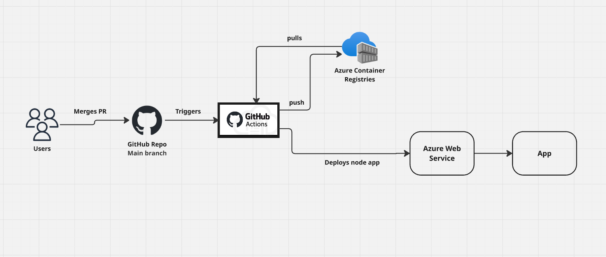

# GitHub Actions CI/CD Workflow for Node.js Docker App

This directory contains the GitHub Actions workflow used to automatically deploy a Dockerized Node.js application to Azure App Service.

## 📄 Workflow File

Path: `.github/workflows/azure-deploy.yml`

This workflow runs on every push to the `main` branch and performs the following steps:

1. **Checkout Code** – Retrieves the latest code from the repository.
2. **Login to Azure** – Uses `AZURE_CREDENTIALS` to authenticate via Azure CLI.
3. **Build Docker Image** – Builds the Docker image from the `app/` directory and push to ACR.
4. **Deploy to Azure Web App** – Pushes and deploys the image to Azure App Service.

## 🔐 Required Repository Secrets

These secrets must be configured in your GitHub repository::

- AZURE_ACR_LOGIN_SERVER
- AZURE_CLIENT_ID
- AZURE_CLIENT_SECRET
- AZURE_CONTAINER_IMAGE_NAME
- AZURE_SUBSCRIPTION_ID
- AZURE_TENANT_ID
- AZURE_WEBAPP_NAME

## 📎 Reference

- [GitHub Actions Docs](https://docs.github.com/en/actions)
- [Deploy to Azure Web App using GitHub Actions](https://learn.microsoft.com/en-us/azure/app-service/deploy-container-github-action)

## Architecture Diagram:

